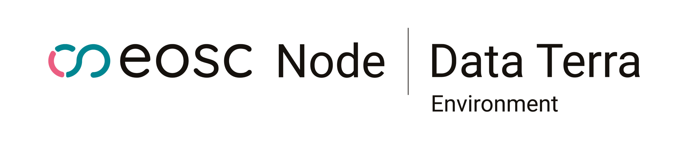

# EOSC Node Data Terra

Data Terra Research Infrastructure brings to the EOSC Federation a unique combination of thematic expertise, operational research services, and interoperable digital infrastructure dedicated to Earth system, environmental and biodiversity sciences. As the French national research e-infrastructure in this domain, Data Terra federates five national data hubs and connects major European research infrastructures, enabling seamless access to multidisciplinary data, services, and scientific workflows.

More broadly, Data Terra and its strategic collaboration with NFDI4Earth in the framework of the EOSC Node illustrate the added value that science-driven national research infrastructures bring to the EOSC Federation. Being closely connected to research laboratories and scientific communities, they are uniquely positioned to develop and continuously evolve services, data resources, and interoperability frameworks that directly address users' scientific requirements. This proximity enables rapid technical innovation, the validation of federating capabilities in operational research environments, and the deployment of reproducible cross-disciplinary workflows. The integration into the EOSC Federation will strengthen the European ecosystem by providing a trusted thematic node capable of supporting large-scale environmental research while ensuring interoperability with other EOSC Nodes.

# How to use the documentation

Whether you’re a **scientist** exploring climate change, a **developer** building data-driven applications, or a **decision-maker** seeking evidence-based insights, this documentation will guide you through:

* The digital infrastructure and architecture behind EOSC Node Data Terra to support seamless data sharing, processing, and collaboration across the EOSC ecosystem.
* The Interoperability Framework of EOSC Node Data Terra that enables the Federating Capabilities with the broader EOSC Ecosystem
